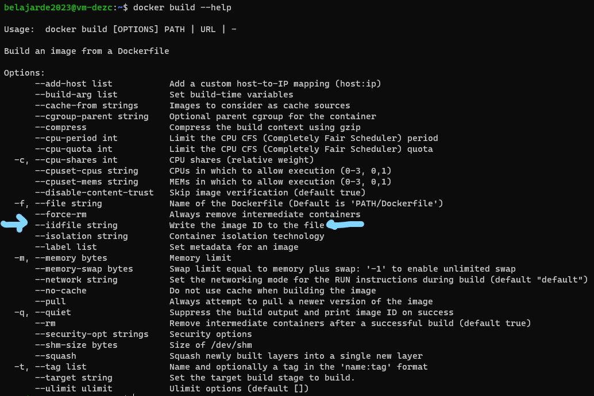
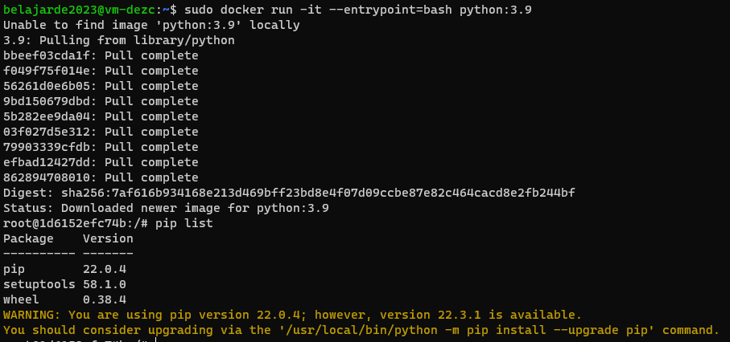

## Week 1 Homework

In this homework we'll prepare the environment 
and practice with Docker and SQL


## Question 1. Knowing docker tags

Run the command to get information on Docker 

```docker --help```

Now run the command to get help on the "docker build" command

Which tag has the following text? - *Write the image ID to the file* 

- `--imageid string`
- `--iidfile string`  **
- `--idimage string`
- `--idfile string`


**Explanation**

To achieve the task of writing images ID to a file after building an image, we can use "docker build" command. By typing ```docker build --help``` in the command line, we can access the options available for this command, including the "--iidfile" option. This option allows us to specify a file path where the image ID of the newly built image will be written. 




## Question 2. Understanding docker first run 

Run docker with the python:3.9 image in an interactive mode and the entrypoint of bash.
Now check the python modules that are installed ( use pip list). 
How many python packages/modules are installed?

- 1
- 6
- 3 **
- 7

**Explanation**

To run Docker with the python:3.9 image in an interactive mode and the entrypoint of bash, you can use the following command:

```docker
docker run -it --entrypoint=bash python:3.9
```

This command will start an interactive session with the python:3.9 image and the entrypoint of bash.

Once inside the container, you can use the command `pip list` to check the python modules that are installed.

```python
pip list
```



# Prepare Postgres

Run Postgres and load data as shown in the videos
We'll use the green taxi trips from January 2019:

```wget https://github.com/DataTalksClub/nyc-tlc-data/releases/download/green/green_tripdata_2019-01.csv.gz```

You will also need the dataset with zones:

```wget https://s3.amazonaws.com/nyc-tlc/misc/taxi+_zone_lookup.csv```

Download this data and put it into Postgres (with jupyter notebooks or with a pipeline)


## Question 3. Count records 

How many taxi trips were totally made on January 15?

Tip: started and finished on 2019-01-15. 

Remember that `lpep_pickup_datetime` and `lpep_dropoff_datetime` columns are in the format timestamp (date and hour+min+sec) and not in date.

- 20689
- 20530 **
- 17630
- 21090

**Explanation**

## Question 4. Largest trip for each day

Which was the day with the largest trip distance
Use the pick up time for your calculations.

- 2019-01-18
- 2019-01-28
- 2019-01-15 **
- 2019-01-10

**Explanation**

## Question 5. The number of passengers

In 2019-01-01 how many trips had 2 and 3 passengers?
 
- 2: 1282 ; 3: 266
- 2: 1532 ; 3: 126
- 2: 1282 ; 3: 254 **
- 2: 1282 ; 3: 274

**Explanation**


## Question 6. Largest tip

For the passengers picked up in the Astoria Zone which was the drop off zone that had the largest tip?
We want the name of the zone, not the id.

Note: it's not a typo, it's `tip` , not `trip`

- Central Park
- Jamaica
- South Ozone Park
- Long Island City/Queens Plaza **

**Explanation**