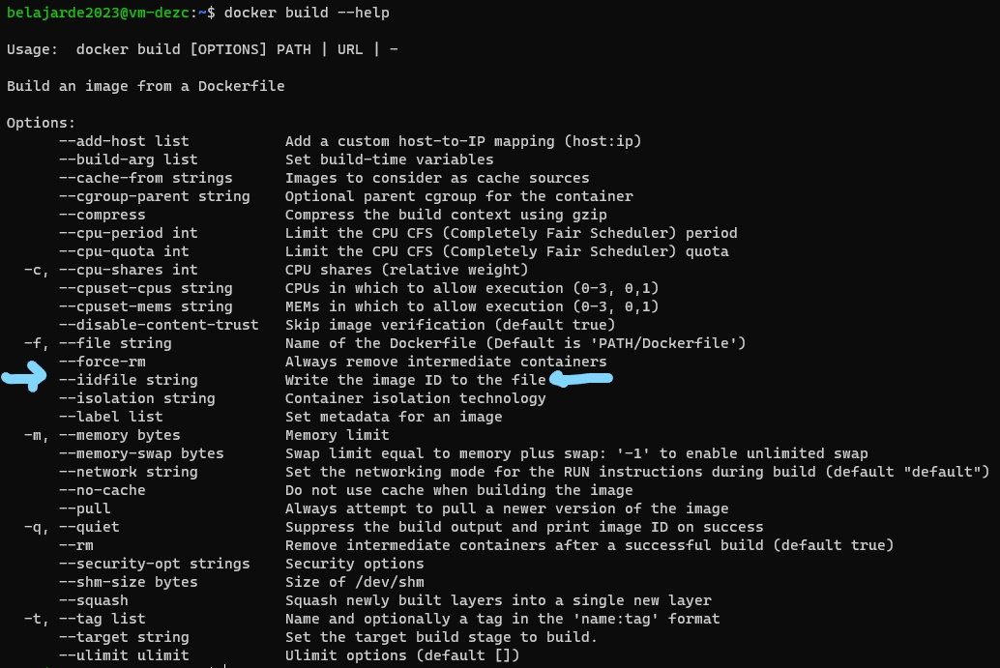
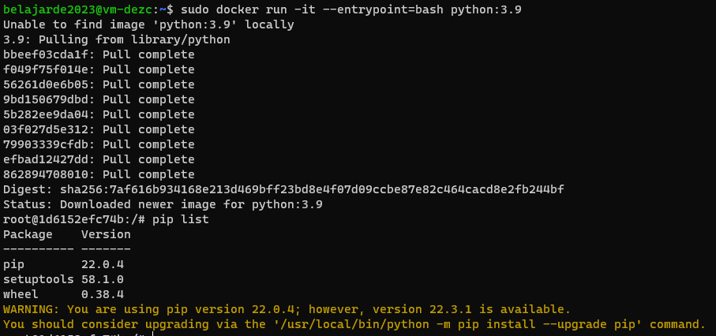

## Week 1 Homework

In this homework we'll prepare the environment 
and practice with Docker and SQL


## Question 1. Knowing docker tags

Run the command to get information on Docker 

```docker --help```

Now run the command to get help on the "docker build" command

Which tag has the following text? - *Write the image ID to the file* 

- `--imageid string`
- `--iidfile string`  **
- `--idimage string`
- `--idfile string`


**Explanation**

To achieve the task of writing images ID to a file after building an image, we can use "docker build" command. By typing ```docker build --help``` in the command line, we can access the options available for this command, including the "--iidfile" option. This option allows us to specify a file path where the image ID of the newly built image will be written. 




## Question 2. Understanding docker first run 

Run docker with the python:3.9 image in an interactive mode and the entrypoint of bash.
Now check the python modules that are installed ( use pip list). 
How many python packages/modules are installed?

- 1
- 6
- 3 **
- 7

**Explanation**

To run Docker with the python:3.9 image in an interactive mode and the entrypoint of bash, you can use the following command:

```docker
docker run -it --entrypoint=bash python:3.9
```

This command will start an interactive session with the python:3.9 image and the entrypoint of bash.

Once inside the container, you can use the command `pip list` to check the python modules that are installed.

```python
pip list
```



# Prepare Postgres

Run Postgres and load data as shown in the videos
We'll use the green taxi trips from January 2019:

```wget https://github.com/DataTalksClub/nyc-tlc-data/releases/download/green/green_tripdata_2019-01.csv.gz```

You will also need the dataset with zones:

```wget https://s3.amazonaws.com/nyc-tlc/misc/taxi+_zone_lookup.csv```

Download this data and put it into Postgres (with jupyter notebooks or with a pipeline)


**Explanation**

In the previous step, we already try 'docker run' to start single container, we will use docker compose to start multiple containers at once. Dockers compose allows to define and configure multiple services in a single file, and then start and stop all of the services together using a single command. Docker Compose provides features such as linking containers together and setting environment variables.

```yaml
services:
  postgres:
    image: postgres:latest
    ports:
      - "5432:5432"
    volumes:
      - pgdata:/var/lib/postgresql/data
    environment:
      - POSTGRES_USER=root
      - POSTGRES_PASSWORD=root
      - POSTGRES_DB=ny_taxi
  pgadmin:
    image: dpage/pgadmin4:latest
    ports:
      - "80:80"
    volumes:
      - pgadmin-data:/var/lib/pgadmin
    environment:
      - PGADMIN_DEFAULT_EMAIL=admin@admin.com
      - PGADMIN_DEFAULT_PASSWORD=root
volumes:
  pgdata:
  pgadmin-data:
```

This code you can find in the file `docker-compose.yaml`. This file sets up two service `postgres` and `pgadmin`.

The `postgres` service uses the `postgres:latest` image, which is the latest version of the PostgreSQL database. It maps port 5432 in the container to port 5432 on the host machine, and it creates a volume named `pgdata` to store data. It also sets environment variables for the PostgreSQL user, password, and default database.

The `pgadmin` service uses the `dpage/pgadmin4:latest` image, which is the latest version of the pgAdmin 4 web interface for managing PostgreSQL databases. It maps port 80 in the container to port 80 on the host machine, and it creates a volume named `pgadmin-data` to store data. It also sets environment variables for the default email and password for the pgAdmin interface.

The `volumes` section defines the named volumes that the services use, `pgdata` and `pgadmin-data`.

Overall, this compose file creates a PostgreSQL database and pgAdmin web interface, both of which are running on the latest version, and both are accessible on the host machine on ports 5432 and 80 respectively.

To run this file, you can go to the direcroty where the file is located and can run the command :

```docker
docker-compose up -d
```

It will run the services in the background. 

To stop the service, run this command :

```docker
docker-compose down
```

After successfully run PostgreSQl using docker-compose, the next step is to ingest csv data that already downloaded put into PostgreSQL. 

I have already created the script `ingest.py` to import data into PostgreSQL. I am retrieving the data using `wget` from a specified link and saving it into `data` folder or any desired folder, then calling it in the `ingest.py` script.

That script is used to import a CSV file into a PostgreSQL database. The script takes several command line arguments such as hostname, port number, database name, username, password, CSV file URL, and table name. The script also allows for optional arguments such as date columns and chunk size.

The script uses the argparse module to parse the command line arguments and create a parser. The script then uses the SQLAlchemy library to create a connection to the PostgreSQL database and the Pandas library to read the CSV file.

The script first creates a table with the same schema as the CSV file, mapping pandas data types to PostgreSQL data types using a dictionary. It then reads the CSV file in chunks and inserts the data into the table, printing the number of rows processed at each step. The script also calculates the time taken to complete the process and the total number of rows in the CSV file.

The script contains try-except block to catch any exceptions that may occur during the process. This script can be run from command line by providing the required arguments. For example :

```cmd
python script.py --host localhost --port 5432 --database testdb --user postgres --password secret --url data.csv --table_name data_table --date_columns date_col1 date_col2 --chunk_size 1000
```

In this example, the script is being run on the `localhost` at port 5432, connecting to the testdb `database` using the postgres `username` and secret `password`. The script is importing data from the `url` data.csv file and creating a `table_name` named data_table. The date_col1 and date_col2 columns are specified as date columns and the chunk size is set to 1000.

You can adjust the arguments to match your environment and requirements.


## Question 3. Count records 

How many taxi trips were totally made on January 15?

Tip: started and finished on 2019-01-15. 

Remember that `lpep_pickup_datetime` and `lpep_dropoff_datetime` columns are in the format timestamp (date and hour+min+sec) and not in date.

- 20689
- 20530 **
- 17630
- 21090

**Explanation**

You can check this query from the `query.sql` file.

```sql
SELECT COUNT(*) AS total_trips
FROM public.tripdata AS td
WHERE td.lpep_pickup_datetime BETWEEN  '2019-01-15 00:00:00' AND '2019-01-15 23:59:59'
AND td.lpep_dropoff_datetime BETWEEN  '2019-01-15 00:00:00' AND '2019-01-15 23:59:59';
```

| **total_trips** |
|-----------------|
| 20530           |

## Question 4. Largest trip for each day

Which was the day with the largest trip distance
Use the pick up time for your calculations.

- 2019-01-18
- 2019-01-28
- 2019-01-15 **
- 2019-01-10

**Explanation**

You can check this query from the `query.sql` file.

```sql
SELECT td.lpep_pickup_datetime::date AS date_trip,
	MAX(trip_distance) AS largest_distance
FROM public.tripdata AS td
GROUP BY td.lpep_pickup_datetime::date
ORDER BY largest_distance DESC
LIMIT 1;
```

| **date_trip** | **largest_distance** |
|---------------|----------------------|
| 2019-01-15  | 117.99               |

## Question 5. The number of passengers

In 2019-01-01 how many trips had 2 and 3 passengers?
 
- 2: 1282 ; 3: 266
- 2: 1532 ; 3: 126
- 2: 1282 ; 3: 254 **
- 2: 1282 ; 3: 274

**Explanation**

You can check this query from the `query.sql` file.

```sql
SELECT COUNT(CASE WHEN td.passenger_count = 2 THEN passenger_count END) AS passenger_2,
	COUNT(CASE WHEN td.passenger_count = 3 THEN passenger_count END) AS passenger_3
FROM public.tripdata AS td
WHERE td.lpep_pickup_datetime::date = '2019-01-01';
```

| **passenger_2** | **passenger_3** |
|-----------------|-----------------|
| 1282            | 254             |


## Question 6. Largest tip

For the passengers picked up in the Astoria Zone which was the drop off zone that had the largest tip?
We want the name of the zone, not the id.

Note: it's not a typo, it's `tip` , not `trip`

- Central Park
- Jamaica
- South Ozone Park
- Long Island City/Queens Plaza **

**Explanation**

You can check this query from the `query.sql` file.

```sql
SELECT tz_do."Zone" AS dropout_zone,
	MAX(td.tip_amount) AS max_tip
FROM public.tripdata AS td
INNER JOIN public.taxi_zone AS tz_pu
	ON td."PULocationID" = tz_pu."LocationID"
INNER JOIN public.taxi_zone AS tz_do
	ON td."DOLocationID" = tz_do."LocationID"
WHERE tz_pu."Zone" = 'Astoria'
GROUP BY tz_do."Zone"
ORDER BY max_tip DESC
LIMIT 1;
```

| **dropout_zone**              | **max_tip** |
|-------------------------------|-------------|
| Long Island City/Queens Plaza | 88          |