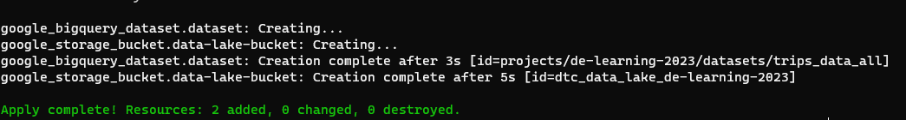

## Week 1 Homework

In this homework we'll prepare the environment by creating resources in GCP with Terraform.

In your VM on GCP install Terraform. Copy the files from the course repo
[here](https://github.com/DataTalksClub/data-engineering-zoomcamp/tree/main/week_1_basics_n_setup/1_terraform_gcp/terraform) to your VM.

Modify the files as necessary to create a GCP Bucket and Big Query Dataset.


## Question 1. Creating Resources

After updating the main.tf and variable.tf files run:

```
terraform apply
```

**Explanation**

Once I have copied the main.tf and variables.tf files from the repo class and made the necessary modifications, I will run the following command to initialize and apply Terraform:

`terraform init` - Initialize a Terraform working directory. This sets up the necessary files and plugins for Terraform to start managing infrastructure.

`terraform plan` - Create and preview an execution plan. This shows what changes Terraform will make to the infrastructure, without actually making the changes.

`terraform apply` - Apply the changes required to reach the desired state of the configuration, or the pre-determined set of actions generated by a Terraform plan.

This is the outcome after executing `terraform apply` command.

```terraform
google_bigquery_dataset.dataset: Creating...
google_storage_bucket.data-lake-bucket: Creating...
google_bigquery_dataset.dataset: Creation complete after 3s [id=projects/de-learning-2023/datasets/trips_data_all]
google_storage_bucket.data-lake-bucket: Creation complete after 5s [id=dtc_data_lake_de-learning-2023]
```



